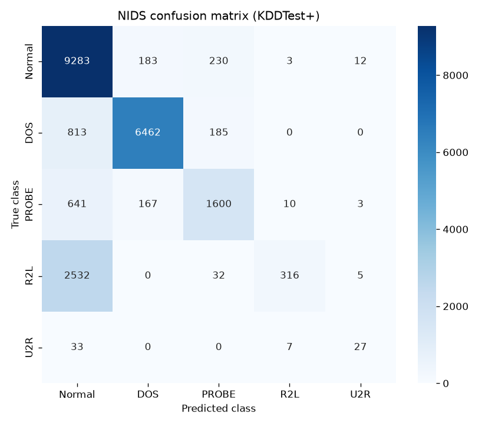

# 🛡️ ML-Based Network Intrusion Detection System (NIDS)


A production-ready **Network Intrusion Detection System** built with **PyTorch**
and served as a live **Flask** web app. It classifies network traffic into five
classes using the **NSL-KDD** dataset (41 features):

| Class | Meaning |
|-------|---------|
| 🟢 **Normal** | Benign traffic |
| 🔴 **DOS**    | Denial of Service (e.g. neptune, smurf) |
| 🟡 **PROBE**  | Scanning / reconnaissance (e.g. satan, portsweep) |
| 🟠 **R2L**    | Remote-to-Local (e.g. guess_passwd, warezmaster) |
| 🟣 **U2R**    | User-to-Root privilege escalation (e.g. buffer_overflow) |

The detector uses a **two-stage (layered) strategy**:

1. A **binary** neural network decides *Normal vs Attack* (high-recall gate).
2. If flagged as an attack, a **multi-class** neural network identifies the
   specific attack type.

> **Why two stages instead of one 5-class model?** The two questions carry very
> different costs. Missing an attack outright is far worse than mislabelling
> which family it belongs to, so stage 1 optimises purely for recall behind a
> single tunable dial (`inference.attack_threshold`) that trades false alarms
> for detection. Stage 2 then types the attack *already knowing* it is hostile,
> so it never spends capacity separating 67,343 normal connections from 52 U2R
> ones — it only has to tell four attack families apart.

**Contents** — [Architecture](#-architecture) · [Dataset](#-dataset) ·
[Structure](#-project-structure) · [Quickstart](#-quickstart) ·
[Web UI](#-using-the-web-ui) · [JSON API](#-json-api) ·
[Model details](#-model-details) · [Results](#-results) ·
[Production](#-production-notes) · [Troubleshooting](#-troubleshooting) ·
[Configuration](#-configuration)

---

## 📐 Architecture

```
┌──────────────┐    ┌──────────────┐    ┌───────────────────┐    ┌──────────────┐
│  Web form /  │──▶ │  Flask app   │──▶ │  Preprocessor      │──▶ │  PyTorch     │
│  JSON client │    │  (app/app.py)│    │  (scaler+encoder)  │    │  models      │
└──────────────┘    └──────────────┘    └───────────────────┘    └──────┬───────┘
        ▲                                                                │
        │                     ┌──────────────────────────┐              │
        └──────────────────── │  Normal / DOS / PROBE /   │ ◀────────────┘
                              │  R2L / U2R  + confidence  │  (binary gate → multiclass)
                              └──────────────────────────┘
```

The **exact same** preprocessing objects (`StandardScaler` + `OneHotEncoder`)
fitted during training are serialized and reloaded at inference time, so the
transformation is guaranteed identical between training and serving.

---

## 🗃️ Dataset

**NSL-KDD** — the de-duplicated successor to KDD Cup '99, with the redundant
records that let naive models score artificially high removed.

| Class | Train | % | KDDTest+ | % | Note |
|-------|------:|------:|---------:|------:|------|
| 🟢 Normal | 67,343 | 53.46% | 9,711 | 43.08% | |
| 🔴 DOS    | 45,927 | 36.46% | 7,460 | 33.09% | |
| 🟡 PROBE  | 11,656 |  9.25% | 2,421 | 10.74% | |
| 🟠 R2L    |    995 |  0.79% | 2,885 | 12.80% | **16× over-represented in test** |
| 🟣 U2R    |     52 |  0.04% |    67 |  0.30% | 7× over-represented in test |
| **Total** | **125,973** | | **22,544** | | |

Two properties of this table drive everything else in the project:

1. **Extreme training imbalance** — 67,343 Normal connections against **52**
   U2R, a 1,295:1 ratio. Unweighted training simply ignores U2R and still
   scores well, so the multi-class loss is weighted by inverse class frequency
   (U2R receives ~487× the weight of Normal) to force the model to care about
   the rare classes.
2. **KDDTest+ is a deliberately different distribution.** R2L is 0.79% of the
   training set but 12.80% of the test set, and most of those test records are
   attack variants that never appear in training. This is the single reason the
   two result regimes below diverge so sharply — and why quoting only the
   validation figure would misrepresent the system.

**Feature encoding** — every connection carries 41 features: **38 numeric**
(z-score standardised) and **3 symbolic** (`protocol_type`, `service`, `flag`)
one-hot expanded into **84** columns, for a final **122-dimensional** input
vector.

---

## 📁 Project structure

```
.
├── config.yaml               # Hyperparameters & artifact paths
├── requirements.txt
├── run_all.py                # download → preprocess → train → evaluate
│
├── data/
│   └── download_data.py      # Fetch NSL-KDD from public mirrors
│
├── src/                      # PyTorch backend (training + inference)
│   ├── schema.py             # 41-feature layout + attack→class mapping
│   ├── config.py             # config.yaml loader
│   ├── preprocess.py         # encode + scale, save artifacts
│   ├── dataset.py            # torch Dataset
│   ├── model.py              # BinaryClassifier / MultiClassClassifier
│   ├── train.py              # training loop (early stopping, class weights)
│   ├── evaluate.py           # test-set metrics + confusion matrix
│   └── predict.py            # two-stage inference (Predictor)
│
├── app/                      # Flask web layer
│   ├── app.py                # routes: / /predict /api/predict /health
│   ├── preprocessor.py       # form field groups + parsing
│   └── predictor.py          # artifact availability + Predictor accessor
│
├── templates/                # index.html, result.html (Jinja2)
├── static/css/style.css      # styling
├── static/js/main.js         # attack-type presets for the form
├── notebooks/EDA.ipynb       # exploratory data analysis
├── tests/test_api.py         # endpoint tests
│
├── models/                   # (generated) *.pt, *.pkl, metadata.json
└── reports/                  # (generated) metrics.json, confusion_matrix.png
```

---

## 🚀 Quickstart

### 1. Install dependencies

```bash
python -m venv .venv
# Windows:  .venv\Scripts\activate
# macOS/Linux:  source .venv/bin/activate
pip install -r requirements.txt
```

> For a smaller CPU-only PyTorch:
> `pip install torch --index-url https://download.pytorch.org/whl/cpu`

### 2. Get the dataset

```bash
python data/download_data.py
```

This downloads `KDDTrain+.txt` and `KDDTest+.txt` into `data/`. If the mirrors
are unreachable, download them manually (UNB NSL-KDD or any GitHub mirror) and
drop the two `.txt` files into `data/`.

### 3. Train the models

```bash
python -m src.train
```

This runs preprocessing automatically (if needed), trains both networks, and
writes artifacts to `models/`:
`binary_model.pt`, `multiclass_model.pt`, `scaler.pkl`, `encoder.pkl`,
`label_encoder.pkl`, `metadata.json`.

### 4. Evaluate (optional)

```bash
python -m src.evaluate
```

Prints per-class precision/recall/F1, the confusion matrix and the binary
detection rate / false-alarm rate, and saves `reports/metrics.json` +
`reports/confusion_matrix.png`.

### 5. Run the web app

```bash
python app/app.py
# open http://localhost:5000
```

### ⚡ Or do everything at once

```bash
python run_all.py      # download → preprocess → train → evaluate
python app/app.py
```

---

## 🖥️ Using the web UI

- Open `http://localhost:5000`.
- Click a **sample preset** (🟢 Normal, 🔴 DOS, 🟡 PROBE, 🟠 R2L, 🟣 U2R) to
  auto-fill a representative connection, or fill the 41 fields manually.
- Click **Analyze Traffic** to get the predicted class, a confidence bar and the
  full per-class probability breakdown.

## 🔌 JSON API

`POST /api/predict` — send any subset of the 41 features; omitted fields fall
back to benign defaults.

```bash
curl -X POST http://localhost:5000/api/predict \
  -H "Content-Type: application/json" \
  -d '{"features": {"protocol_type":"tcp","service":"private","flag":"S0",
       "src_bytes":0,"dst_bytes":0,"count":123,"srv_count":6,
       "serror_rate":1.0,"srv_serror_rate":1.0,"dst_host_serror_rate":1.0}}'
```

Response:

```json
{
  "predicted_class": "DOS",
  "is_attack": true,
  "confidence": 0.99,
  "attack_probability": 0.99,
  "class_probabilities": {"Normal": 0.0, "DOS": 0.99, "PROBE": 0.0, "R2L": 0.0, "U2R": 0.0}
}
```

Other routes: `GET /` (form), `POST /predict` (form submission), `GET /health`
(liveness + whether models are loaded).

---

## 🧠 Model details

**Binary classifier** — `122 → 128 → 64 → 32 → 1`, ReLU + dropout
`[0.3, 0.2, 0.0]`, `BCEWithLogitsLoss` with `pos_weight` to protect attack
recall.

**Multi-class classifier** — `122 → 256 (BatchNorm) → 128 → 64 → 5`, ReLU +
dropout `[0.4, 0.3, 0.2]`, `CrossEntropyLoss` weighted by inverse class
frequency to handle the severe R2L/U2R imbalance. BatchNorm sits on the widest
layer only, where it stabilises training against that imbalance.

**Training** — Adam (`lr=1e-3`, weight decay `1e-4`), `StepLR` decay (×0.5
every 15 epochs), early stopping on validation loss (patience 10), stratified
85/15 train/val split of KDDTrain+, batch size 256, seed 42. All knobs live in
[`config.yaml`](config.yaml).

> **Reproducibility** — with the pinned dependency versions the binary model
> retrains bit-identically. The multi-class model varies in the third decimal,
> confined to R2L/U2R, where a handful of sample flips move F1 by whole points
> because those classes have only 8 and 149 validation examples respectively.

---

## 📊 Results

Trained on CPU with the default [`config.yaml`](config.yaml). Evaluated on two
regimes (regenerate anytime with `python -m src.evaluate` → `reports/metrics.json`):

### In-distribution — 15% held-out validation of KDDTrain+ *(the 98%+ target regime)*

| Binary (Normal vs Attack) | Value |
|---------------------------|-------|
| Accuracy                  | **99.6%** |
| Detection rate (recall)   | **99.7%** |
| False-alarm rate          | **0.4%**  |
| ROC-AUC                   | 0.9999 |

Multi-class accuracy: **99.6%** (per-class F1 ≈ 1.00 for Normal/DOS/PROBE).

### KDDTest+ — official test set, contains novel attacks absent from training

| Binary (Normal vs Attack) | Value |
|---------------------------|-------|
| Accuracy                  | 79.9% |
| Detection rate (recall)   | 67.6% |
| Precision                 | 95.8% |
| False-alarm rate          | 4.0%  |
| ROC-AUC                   | 0.9362 |

Multi-class accuracy: 78.2%.

### Per-class F1 — where the generalisation gap actually lives

| Class | Validation F1 | KDDTest+ F1 | Δ |
|-------|--------------:|------------:|--:|
| 🟢 Normal | 0.997 | 0.804 | −0.193 |
| 🔴 DOS    | 0.999 | 0.904 | −0.095 |
| 🟡 PROBE  | 0.991 | 0.716 | −0.275 |
| 🟠 R2L    | 0.918 | **0.172** | **−0.746** |
| 🟣 U2R    | 0.706 | 0.430 | −0.276 |

**R2L is the whole story.** Its recall collapses from **94.0% → 9.5%** while
precision stays high at 94.5% — the model has not become *imprecise* about R2L,
it has gone *blind* to it. R2L attacks impersonate legitimate sessions
(password guessing, malicious file transfer), so their KDDTest+ variants share
almost no surface structure with the 995 examples in training, and the model
files them as Normal. DOS and PROBE, whose signatures are structural rather
than behavioural, degrade far more gracefully.

> **Why the gap?** NSL-KDD's test set is deliberately constructed with attack
> variants (especially R2L/U2R) that never appear in training, so it measures
> generalisation to *unseen* attacks. ~78–80% on KDDTest+ is consistent with
> published results for this class of model — the 98%+ figure is the
> in-distribution regime. Lower `inference.attack_threshold` in `config.yaml` to
> trade a higher false-alarm rate for more detection recall.



## 🏭 Production notes

- **Linux / macOS** - serve with gunicorn:
  `gunicorn -w 4 -b 0.0.0.0:5000 app.app:app`.
- **Windows** - gunicorn imports `fcntl` and cannot run there.
  Use waitress instead: `python -m waitress --port=5000 app.app:app`.
- Models load **once per worker** (cached singleton) for fast inference.
- `GET /health` is suitable for uptime and load-balancer probes.
- Lower `inference.attack_threshold` in `config.yaml` to trade false alarms for
  higher detection recall.

---

## 🧪 Tests

```bash
pytest -q
```

The endpoint tests pass whether or not models are trained (they assert the
graceful 503 path when artifacts are missing).

---

## 🩺 Troubleshooting

<details>
<summary><strong>Predictions return 503 <code>models_not_trained</code></strong></summary>

The artifacts in `models/` are missing. `GET /health` lists exactly which ones
via `missing_artifacts`. Run `python -m src.train` to generate them.

</details>

<details>
<summary><strong><code>ModuleNotFoundError: No module named 'fcntl'</code> when starting gunicorn</strong></summary>

Gunicorn is Unix-only — `fcntl` does not exist on Windows. Use waitress
instead: `python -m waitress --port=5000 app.app:app`. See
[Production notes](#-production-notes).

</details>

<details>
<summary><strong><code>DeprecationWarning: Setting the shape on a NumPy array...</code></strong></summary>

Harmless, and **not** caused by stale artifacts — retraining will not clear it.
It originates inside joblib's own read path (`numpy_pickle.py`), which assigns
to `array.shape`, deprecated in NumPy 2.5. It fires on any joblib load
regardless of when the file was written. No fixed joblib release exists yet,
which is exactly why `numpy` is pinned to `2.5.2` in `requirements.txt` — an
unpinned upgrade could turn this warning into a hard load failure.

</details>

<details>
<summary><strong><code>FileNotFoundError</code> for KDDTrain+.txt</strong></summary>

Run `python data/download_data.py`. If the mirrors are unreachable, download
the NSL-KDD archive manually and drop `KDDTrain+.txt` and `KDDTest+.txt` into
`data/`.

</details>

<details>
<summary><strong>Changed <code>config.yaml</code> but nothing happened</strong></summary>

`src/train.py` reuses the cached `data/processed/dataset.npz` and only re-runs
preprocessing when that file is **missing**. If you changed anything affecting
encoding or scaling, re-run `python -m src.preprocess` explicitly first, or
delete the `.npz`.

</details>

---

## ⚙️ Configuration

Everything tunable lives in [`config.yaml`](config.yaml): dataset paths, model
widths/dropouts, optimizer settings, early-stopping patience, class-weighting
toggle and the inference threshold. Edit it and re-run `python -m src.train`.

---

## ⚠️ Disclaimer

Trained on **NSL-KDD**, an academic benchmark. Excellent for learning,
demonstrations and research, but not a drop-in production sensor for modern
live networks — real deployments need current traffic, online feature
extraction and continuous retraining. Use for education and research.
