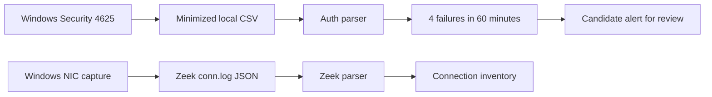

# Live pilot data contract (v1)

The live pilot is separate from the NSL-KDD 41-feature model. Its current
inputs are a minimized Windows Security **4625** CSV and Zeek JSON `conn.log`.
The CLI replays both sources, reports aggregate counts, and applies a
failed-logon burst rule in observation mode. It does not classify network
connections as attacks.

## Windows auth export

Run `scripts/export_windows_auth.ps1` from elevated PowerShell. The default
file is `%USERPROFILE%\nids-pilot\auth_failures_7d.csv`, outside Git. Required
columns:

| Column | Type | Meaning |
| --- | --- | --- |
| `time_local` | ISO 8601 with offset | Event time; parser normalizes it to UTC. |
| `event_id` | integer | Must be 4625 for this schema. |
| `record_id` | positive integer | Unique Security log record ID within the export. |
| `logon_type` | positive integer | Windows logon type, such as 2 (interactive), 3 (network), or 10 (Remote Desktop). |
| `status_signed` | integer | Windows status code as exported by PowerShell. |
| `substatus_signed` | integer | Additional Windows failure code. |

No account name, workstation name, or source IP is exported. This limits
privacy exposure but also means the rule counts failures across all accounts
and cannot identify a remote source. Event 4625 and its fields are documented
by [Microsoft](https://learn.microsoft.com/en-us/previous-versions/windows/it-pro/windows-10/security/threat-protection/auditing/event-4625).

Optional reviewed labels use a separate CSV with `record_id,label` columns.
Allowed labels are `normal`, `attack`, and `unknown`. An absent label is
`unknown`; a failed logon is not automatically an attack.

## Zeek connection records

`live_ids.zeek.parse_conn_log` accepts one JSON object per line. Required
Zeek fields are `ts`, `uid`, `id.orig_h`, `id.orig_p`, `id.resp_h`, `id.resp_p`,
and `proto`. The caller supplies a `capture_id`; `(capture_id, uid)` identifies
a connection. The parser converts `ts` to UTC and validates addresses, ports,
and non-negative numeric values. Missing optional `duration`, byte/packet
counts, `service`, or `conn_state` remain `null`. Malformed records fail with
their line number, rather than receiving NSL-KDD defaults.

The capture, PCAPNG, Zeek logs, and full records remain outside Git. The replay
report includes only the connection count and capture ID; it does not print
addresses. `weird.log` is not interpreted as an attack label.

## Observation alert

`live_ids.auth.failed_logon_alerts` emits a candidate after four 4625 events
in a rolling 60-minute window, with a 60-minute cooldown. The threshold came
from a small benign baseline and is provisional. `scripts/watch_windows_auth.ps1`
polls the Security log every minute by default and writes candidate alerts
under `%USERPROFILE%\nids-pilot`; it never blocks sign-ins. Its state file
prevents repeated candidate warnings during a cooldown across restarts. Each
watch alert stores the triggering event time and alert time separately so
event-to-alert delay can be measured.

The two sources are **not joined by time alone**. A local type-2 logon does not
establish a matching network connection. Any later R2L correlation must use
authorized source evidence and account for clocks, NAT, and missing fields.

## Validation gate

The code can be replayed now, but a live ML model cannot be trained or judged
from benign records alone. Before claiming detection quality, collect
legitimately labeled attack scenarios and a longer normal baseline; split
training, threshold selection, and final test by time or scenario; then report
recall, reviewed false alerts per day, and event-to-alert delay. Keep the
observation rule distinct from a trained model and the existing NSL-KDD demo.
